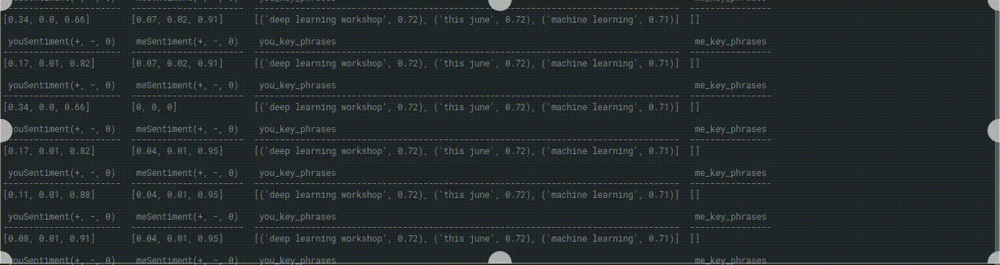

# whatsapp-chat-sentiment
## Whtsapp Chat Sentiment Analyzer

Analyze Whatsapp texts with a friend using AWS Comprehend to get insights into the corresponding sentiments and key phrases of sent and received texts.


## Pre-requisites

The script uses AWS Comprehend to extract emotions and key phrases from texts, and GCP Translate to translate the texts to a target lanuage (English by default). So you need an AWS and GCP account, install the corresponding packages (in Requirements.txt file), enable the corresponding API, and set up the authentication.

#### You can follow these guides
#### To setup **boto3** api: https://boto3.amazonaws.com/v1/documentation/api/latest/guide/quickstart.html
#### To setup **gcp translate** api: https://cloud.google.com/translate/docs/setup

**Note** : After activating GCP Translate API, place the json key file in the gcp folder

## Running the script

Install all the dependencies using the **requirements.txt** file.

Update the **config.json** file.
- Add GCP json key file name under **gcp auth file**.
- Add the name of the friend you want to analyze texts with under **chat with**.
- Set **scroll count** to the number of times you want to scroll up to retrience older chats (approximately).
- Set **wait time** to the number of seconds you want the script to wait for older texts to load before scrolling up.
- Set **num threads** to the number of concurrent threads you want to run to send API requests.
- Set **language script code** to the ISO language code of the script used in the texts.

Run the **main.py** file
```
python3 main.py
```
Open Whatsapp app in your phone, scan the QR Code and let Selenium handle the rest.

[](https://raw.githubusercontent.com/semmet95/whatsapp-chat-sentiment/master/assets/text-scraping.gif)

Once all the texts have been scraped, the script uses GCP Translate and AWS Comprehend API to translate and analyze the texts to extract sentiment data and key phrases, categorized as texts sent by you and texts received. API call responses are displayed as output too (including only the 3 highest scoring key phrases).

[](https://raw.githubusercontent.com/semmet95/whatsapp-chat-sentiment/master/assets/api-calls.gif)

The sentiment data and key phrases are then exported to a csv file in the **exports** folder.


## Managing sentiment and key phrases weights

#### Sentiment weights are updated as follows

```
sentiment_data[key] = round(((text_sentiment[key] + sentiment_data[key] * (ctr - 1)) / ctr), 2)
```
averaging out the weight of each sentiment over the weights returned with every API call.


#### Key phrase weights are updated as follows

```
if all_phrases_weights.get(phrase) is None:
        all_phrases_weights[phrase] = round(sigmoid(phrases_weights[phrase]), 2)

else:
    all_phrases_weights[phrase] = round(sigmoid(all_phrases_weights[phrase] + (random.random() *  phrases_weights[phrase])), 2)
```
To keep the weights within the range of [0,1), sigmoid function is used. This keeps the weights from exploding in case a key phrase is used repetitively. Also a random multiplier in the range [0,1) is introduced if a key phrase is encoutered again, to decrease the effect of frequency on weights.

[](https://www.buymeacoffee.com/gbraad)
